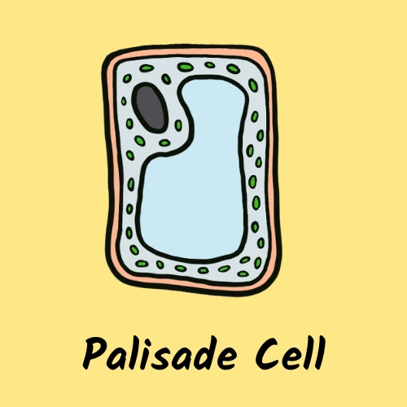

# Specialised Cells 🔬
# - a GCSE Biology Matching Pairs Revision Game

------

This *GCSE Biology Revision Game* is a card-matching game that helps students to memorise **specialised cell types and their functions**. 

A specialised cell is any cell that has developed features to perform a specific job - e.g. a *red blood cell* has developed certain features to perform *its function of carrying oxygen around the body*. The specialised cell types chosen are from **the Biology curriculum at GCSE level**.

 The objective of the game is to **find the matching pairs of cards** - a labeled image of the cell type with a description of its function. 
 This game should hopefully be accessible enough and fun for anyone to play as a **quick-thinking memory style game**, but also can be used as a **revision tool** to help remember different cell types and their functions. 

## Showcase

The **Am I Responsive?** link can be found here - [Am I Responsive?](https://ui.dev/amiresponsive?url=https://tarahwaters.github.io/milestone-project2/)

A **deployed link** to the live website can be found here [Specialised Cells Game](https://tarahwaters.github.io/milestone-project2/)

---

## Table of Contents

---

## UX:
## Strategy
### Target Audience

The target audience of this game are students studying Biology at high school level (GCSE or equvivalent) and also those interested in learning some biological facts. The topic of Specialised Cells is included in the UK biology curriculum at KS3 and GCSE (including iGCSE) and this game can therefore be used as a fun revision / learning tool. It is also designed to be accessible without prior biology knowledge so hopefully will be enjoyed by any user of any age.

### User Requirements and Expectations

- Simple and intuitive user interface
- Instructions are easy to follow
- Gameplay works as expected and is fun to play
- Clear presentation of the content
- Design that is visually attractive
- Accessibility
- Features and navigation system works as expected

### User Stories

#### User
As a user I would like:
- to play a card-matching memory game presented in a visually appealing format
- to learn or revise knowledge about specialised cell types in a fun way
- to play a game with the option of increasing the complexity/challenge
- to read the rules of the game
- to access the prelearning material before testing their knowledge during the game
- to navigate through the elements of the game / website easily
- to receive ongoing feedback about my progression through the game
- to have fun while playing the game (and also learn!).
- to learn some interesting facts about specialised cells
- to have the option of viewing and downloading a summary of the cell types and their functions
- to restart the game to play again
- **to have an option of playing an increased level of difficulty**

---

## Scope
### Trade Offs

Considering the user requirements and expectations, the table below shows the features that should be implemented to make an appealing and functional interactive game for users. Due to time constraints and my current skill level, some of these features are not implemented at this stage.

[X] indicates opportunities that were considered at the planning stage but were deemed not viable/feasible for this project sprint.
Y / N indicates a Yes / No as to whether each opportunity was acheived and implemented at this stage.

| Opportunity                                                      | Importance | Viability / Feasibility | Outcome |
| ---------------------------------------------------------------- | :--------: | :---------------------: | :------:|
| Card-matching memory game that works by user clicking cards      |     5      |            5            |    Y    |
| Timer and move counter that provide up-to-date feedback to user  |     5      |            5            |    Y    |
| HowToPlay modal with set of instructions (with clickable button) |     5      |            5            |    Y    |
| WinMessage modal that pops up when user has completed the game   |     5      |            5            |    Y    |
| Option to restart (with button on main page, also via Win modal) |     5      |            5            |    Y    |
| Access to summary notes page for revision / download afer game   |     3      |            4            |    Y    |
| Option of advanced level / challenge                             |     3      |            2            |    N    |
| Option to adjust audio settings [X]                              |     3      |            2            |    X    |

---

## Structure

### Existing Features

- **How To Play Button**

    - When clicked, this button opens a modal with instructions on how start and play the game. 

    

- **Reset Button**

    - The mobile nav bar toggler, accessible on smaller mobile devices, collapses the navbar into a simple menu button that when clicked can open a list of the pages of the website. This allows for a cleaner UX design which takes up less space, but provides the user with the necessary navigation options. Clicking the icon opens the menu, and clicking again can close the menu.

- **Help Modal**

    - This feature contains images to visually and clearly explain the card match pairs (important, because the user has the option of clicking two of the same 'type' of card for efficiency, but they need to know this will not create a match). It also contains a table displaying the card images and their matching descriptions to provide learning support for the user. The user can understand how to start the game (if they are unsure) by reading "Click any card to start the game!". The help modal can be opened at any time during the game to remind users of how to play. The Boostrap modal contains a 'close' button to exit the modal (or the user can click the background screen to close).

    

- **Win Modal**

    - This feature pops open when a game has been completed (all 8 pairs of cards are matched). It shows a message congratulating the user on completing the game with an animated gif as a celebration. The user's final game time and move counter is included for reference. There are also links to downloadable content (x2 pdf files) which can supplement learning further. There is a 'Play Again!' button included at the bottom so users can restart the game / return to the main page after playing.
    
    

- **Game Card Grid**

    - This feature contains all 16 game cards, separated into 2 well-defined grid containers which are easily distinguished by different card backface designs - cell type (images) and functions (written descriptions). There are 8 matching pairs and the cards flipto reveal their identity upon being clicked. When cards are matched, they remain open. If two cards are clicked that aren't a match, they flip back, allowing the user to try again until they match all pairs.

    

- **Timer**

    - This feature starts when the game begins (ie when a card is clicked). It starts from 00:00 and increments in seconds and minutes. The timer pauses when the help modal is open, so that users can stop to view the instructions without affecting their game time. When the modal closes, the timer resumes. The final time is logged in the win modal message so the user can aim to beat their score if they play again.

    

- **Move Counter**

    - The move counter starts whem the game begins and the first pair of cards have been clicked. It starts from zero and one move is added for each pair of cards that are attempted as a match. The final move count is logged in the win modal message so the user can aim to beat their score if they play again.

    

- **Extra Revision Resources**

    - Links to free revision resources are included as a reward for completing the game and they are accessible from within the win modal message. Links open in a separate tab and offer a set of infocards / flashcards that the user can print and use at home.

    

### Future Features

- **Option to increase difficulty level**
    - The infocards have already been designed with the potential to include 3 separate details to test learning of specialised cells knowledge (required for the GCSE Biology curriculum) - function / location / features. There could be increased difficulties levels where descriptions contain more complex information, or more cell types could be added as a bonus challenge.

- **Different related topic themes**
    - There could be an option to also add more revision topics to the game so the user can improve their knowledge in other areas of the curriculum.

- **Option of sounds effects**
    - Sound effects could be added for when cards are clicked, flipped, matched or not matched. This could be more fun and engaging for the user, and also gives them instant feedback of success or error which may improve learning. This feature could be made optional for when the user prefers a quiet game.

- **Improved responsiveness for smaller devices and for different screen orientations**
    - Details of some issues regarding responsiveness are detailed in the [TESTING.md](TESTING.md) file and these would be worked on in future development. Adding more cell cards as options for the game, could allow the grid layout to be changed (e.g. maximum 3x6 instead of 4x4) to optimise card readability. In future, it may be preferable to also use a responsive grid framework (from Boostrap for example) to avoid some of the issues I faced during styling.

---

## Skeleton

Wireframes for the website were created using the UI wireframe tool, [Balsamiq](https://balsamiq.com/), to plan the layout across desktop, tablet and mobile devices.

The layout and design was kept consistent across the pages / devices as much as possible.

The main game page consists of:

- A title
- A subtitle description of the game
- A countdown timer is on the top left corner ofthe gamegrid - displays how many seconds are remaining during a game
- A moves counter that is on the top right corner of the gamegrid - displays the number of moves made during a game
- A gamegrid of separated into x2 8 divs displaying the rear side of the cards - two cards can be flipped over at a time to make a match
- A reset button is underneath the gamegrid - gives the user the option to reset the game to the beginning
- A howtoplay button is underneath the gamegrid - gives the user the option to view the game instructions and access the prelearning material
- A footer which contains a copyright statement

### Wireframes

These were the initial wireframes created for the project during the planning stage:

**1. Game Grid Wireframes**

- [Mobile and Table Devices](https://github.com/tarahwaters/milestone-project2/blob/main/documentation/readme/wireframe-mob-gamegrid.png "GameGrid Wireframe for Mobile and Tablet Devices")

- [Desktop Devices](https://github.com/tarahwaters/milestone-project2/blob/main/documentation/readme/wireframe-desktop-gamegrid.png "GameGrid Wireframe for Desktop Devices")

**2. HowToPlay Modal Wireframes**

- [Mobile and Table Devices](https://github.com/tarahwaters/milestone-project2/blob/main/documentation/readme/wireframe-mob-howtoplay.png "HowToPlay Modal Wireframe for Mobile and Tablet Devices")

- [Desktop Devices](https://github.com/tarahwaters/milestone-project2/blob/main/documentation/readme/wireframe-desktop-howtoplay.png "HowToPlay Modal Wireframe for Desktop Devices")

**3. WinMessage Modal Wireframes**

- [Mobile and Tablet Devices](https://github.com/tarahwaters/milestone-project2/blob/main/documentation/readme/wireframe-mob-winmessage.png "WinMessage Modal Wireframe for Mobile and Tablet Devices")

- [Desktop Devices](https://github.com/tarahwaters/milestone-project2/blob/main/documentation/readme/wireframe-desktop-winmessage.png "WinMessage Modal Wireframe for Desktop Devices")

## Surface
### Color Scheme

[coolors.co](https://coolors.co/) was used to create a color palette for the design.

### Typography

[fontjoy.com](https://fontjoy.com/) was used to create aesthetic font pairings for the project.

- **Kalam** - for the main title
- **Preahvihear** - for subtitles and headings
- **Sriracha** - for descriptive text (*in the end this font was not utilised)
- with a backup font of **"Sans serif"**

### Card Design

Since the images of specialised cells available online were consistent or visually appealing enough in their design, I decided to draw my own using the Procreate app on my iPad. Here is the the full image containing all the cell drawings used in the game. These were then cropped to add to the individual cards.

The images were resized to 500 x 500px to form the game cards, and a background and name label were added to each using [Canva](https://www.canva.com/) to edit.

The images were then converted to WEBP format to reduce their file size to improve website load times (using [RedKetchup](https://redketchup.io/)).

Example card design:

Card backfaces were designed differently to indicate which type of card they are - i.e. cell type (an image) or function (a description).
This was done to improve the user experience and became part of the game development to also separate the shuffling of the cards.

Example backface card designs:

### Extra Learning Resource

As a prize for completing the game, users have access to a downloadable learning resource which summarises all the cell types used in the game.
Learners can print off the flashcards and use them for their biology revision.

Example images of a free learning resource available to download:

## Tools and Technologies Used:

- **HTML5**
- **CSS**
- **Bootstrap**
- **JavaScript**

- [GitHub and Github Pages](https://github.com/) - used to securely store the code and to host and deploy the live project
- [GitPod](https://www.gitpod.io/) - used as a cloud-based IDE for development
- [Balsamiq](https://balsamiq.com/wireframes/) - used to create wireframes during project planning
- Procreate iPad app - used to draw and export the cell images
- [redketchup.io](https://redketchup.io/) - used for resizing and converting image files to webp format
- [beautifytools](https://beautifytools.com/) - used for beautifying code
- [Coolors](https://coolors.co/) - used to generate a color palette for the website design
- [Canva](https://www.canva.com/) - used to design and edit the card images, gifs and pdf resources used in the game
- [FontJoy](https://fontjoy.com/) - used to generate visually appealing font pairings for  the website
- [JSHint](https://jshint.com/) - used to validate JS code
- [Esprima](https://esprima.org/demo/validate.html) - used to validate JS syntax
- [W3 HTML validator](https://validator.w3.org/nu/) - used to validate HTML
- [W3 Jigsaw](https://jigsaw.w3.org/css-validator/validator) - used to validate CSS
- [Tim Nelson's Markdown Builder](https://traveltimn.github.io/markdown-builder/) to help create the structure and some of the content for the README and TESTING.md files
- [AmIResponsive?](https://ui.dev/amiresponsive?url=https://tarahwaters.github.io/milestone-project2/) - used to create a mockup of the website

## Testing:

For all testing, please refer to the [TESTING.md](TESTING.md) file.

## Deployment:

The site was deployed to GitHub Pages. The steps to deploy are as follows:
- In the [GitHub repository](https://github.com/tarahwaters/milestone-project2), navigate to the Settings tab.
- In the general settings side menu, open **Pages**.
- From the source section drop-down menu, select **Deploy from a branch** and then **Main** Branch, and click "Save".
- The page will be automatically refreshed with a detailed ribbon display to indicate the successful deployment and link to visit the site.

The live link can be found [here](https://tarahwaters.github.io/milestone-project2)

### Local Deployment

This project can be cloned or forked in order to make a local copy on your own system.

#### Cloning

You can clone the repository by following these steps:

1. Go to the [GitHub repository](https://github.com/tarahwaters/milestone-project2) 
2. Locate the Code button above the list of files and click it 
3. Select if you prefer to clone using HTTPS, SSH, or GitHub CLI and click the copy button to copy the URL to your clipboard
4. Open Git Bash or Terminal
5. Change the current working directory to the one where you want the cloned directory
6. In your IDE Terminal, type the following command to clone my repository:
	- `git clone https://github.com/tarahwaters/milestone-project2.git`
7. Press Enter to create your local clone.

Alternatively, if using Gitpod, you can click below to create your own workspace using this repository.

Please note that in order to directly open the project in Gitpod, you need to have the browser extension installed.
A tutorial on how to do that can be found [here](https://www.gitpod.io/docs/configure/user-settings/browser-extension).

## Credits

For help with main game structure and JS functions:
- [FreeCodeCamp.Org JavaScript Memory Game tutorial](https://www.youtube.com/watch?v=ZniVgo8U7ek)
- [Marina Ferreira JS Memory Game tutorial](https://marina-ferreira.github.io/tutorials/js/memory-game/)
- [Nuala Greenwood MS2 Lord of The Rings Memory Card Game](https://nualagr.github.io/the-lord-of-the-rings-game/)

For help with button styling:
- [W3 Schools](https://www.w3schools.com/howto/howto_css_center_button.asp)
- [Moira Hartigan PP2 Alien Memory Game](https://moirahartigan.github.io/Portfolio-2---Alien-Memory-Game/)
- [StackOverflow](https://stackoverflow.com/questions/28261287/how-to-change-btn-color-in-bootstrap)

For help with coding the JS move counter:
- [Dev.to Memory Card Game Tutorial by Adam Nagy](https://dev.to/javascriptacademy/creating-a-memory-card-game-with-html-css-and-javascript-57g1)
- [YouTube Memory Card Game Tutorial by Adam Nagy](https://www.youtube.com/watch?v=xWdkt6KSirw)

For help with coding the JS timer:
- [CodePen](https://codepen.io/FoxyStoat/pen/erzLMG)
- [W3 Schools](https://www.w3schools.com/js/js_timing.asp)
- [Moira Hartigan PP2 Alien Memory Game](https://moirahartigan.github.io/Portfolio-2---Alien-Memory-Game/)

## References 

- **Marina Ferreira**: [Memory Card Game - JavaScript Tutorial](https://marina-ferreira.github.io/tutorials/js/memory-game/)
- **Moira Hartigan's PP2**: [Alien Memory Game](https://moirahartigan.github.io/Portfolio-2---Alien-Memory-Game/) - deployed project and [github](https://github.com/moirahartigan/Portfolio-2---Alien-Memory-Game)

- **Nuala Greenwood's MS2**: [Lord Of The Rings Game](https://nualagr.github.io/the-lord-of-the-rings-game/) - deployed project and [github](https://github.com/nualagr/the-lord-of-the-rings-game)

- **Louise Jones' MS2**: [Tropical Birds Memory Game](https://louisejones101.github.io/memory-game/) - deployed project and [github](https://github.com/louisejones101/memory-game)

- [StackOverflow](https://stackoverflow.com/)
- [MDN Web Docs](https://developer.mozilla.org/en-US/)
- [JavaScript Syntax - W3 Schools](https://www.w3schools.com/js/js_syntax.asp)

## Acknowledgements

- All my friends and family who tested the game and gave me valuable feedback and support along the way
- Code Institute Tutor support
- Cohort Facilitator - [Iris Smok](https://ie.linkedin.com/in/irissmok)
- Mentor for support throughout the project
- Cohort peers and Slack community, especially:
    - [@Nathan Parry_4P_cohort_lead](https://app.slack.com/client/T0L30B202/D04ULFN551P/rimeto_profile/U04EX23NTND) support with coding advice and encouragement 
    - [@Paul Treggiden](https://app.slack.com/client/T0L30B202/D04UYMV6WBG/rimeto_profile/U043S9PT5E1) support with coding advice and encouragement

