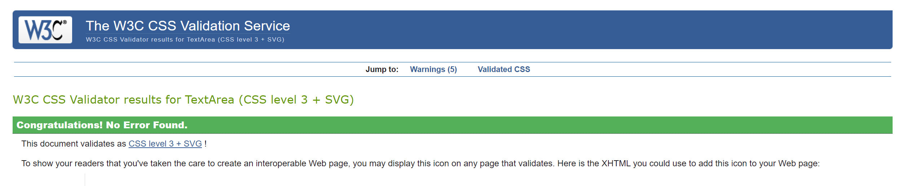

# Testing

Return back to the [README.md](README.md) file.

In this section I will be providing evidence to show that:
- The project **features** work as intended
- The **users** can achieve their goals
- The project is **responsive** across different devices and screen sizes
- The project is **compatible** across different web browsers
- The project uses **valid code** according to standard practice
- The project passes audits for **performance, accessibility, best practices and SEO** (using Lighthouse by Chrome Developer Tools)

## Code Validation

I will use this space to discuss code validation of my code files (where applicable).
I will not validate external libraries/frameworks, such as imported Bootstrap etc.

### HTML

I have used the recommended [HTML W3C Validator](https://validator.w3.org) to validate the HTML file.

I validated the live page using the deployed URL. This gave me a custom URL which I have included in the documentation below. This will make it easier when validating again in future.

| Page | W3C URL | Screenshot | Notes |
| --- | --- | --- | --- |
| Home | [W3C](https://validator.w3.org/nu/?doc=https%3A%2F%2Ftarahwaters.github.io%2Fmilestone-project2%2F) |  | **Pass**: No Errors, 1 warning due to code credit url |

### CSS

I have used the recommended [CSS Jigsaw Validator](https://jigsaw.w3.org/css-validator) to validate my CSS file.

The deployed URL was used to validate the CSS since a single file was used for the project. This gave a custom URL which is included and can be used for future validation. Evidence from the direct code input validation was also included.

| File | Jigsaw URL | Screenshot | Notes |
| --- | --- | --- | --- |
| style.css | [Jigsaw - deployed link](https://jigsaw.w3.org/css-validator/validator?uri=https%3A%2F%2Ftarahwaters.github.io%2Fmilestone-project2%2F&profile=css3svg&usermedium=all&warning=1&vextwarning=&lang=en) |  | **Pass**: no errors, warnings shown are from imported Boostrap styling and also **-webkit-fill-available** is a vendor extension |
| style.css | [Jigsaw - direct input link](https://jigsaw.w3.org/css-validator/validator)  |  | **Pass**: No Errors, warnings are from Boostrap button styling |

### JavaScript

I have used the recommended [JS Hint](https://jshint.com/) to validate my JS script and also [Esprima](https://esprima.org/demo/validate.html) to check for any syntax errors.

<!-- The deployed URL was used to validate the JS since a single file was used for the project. This gave a custom URL which is included and can be used for future validation. Evidence from the direct code input validation was also included. -->

| File | Validator Tool |Screenshot | Notes |
| --- | --- | --- | --- |
| script.js | [JSHint](https://jshint.com/) | | **Pass**: no errors found after adding code to bypass undefined $ jquery and es6 version errors (support found from stackoverflow: [undefined jquery](https://stackoverflow.com/questions/39510736/eslint-dollar-is-not-defined-no-undef) and [es6 errors](https://stackoverflow.com/questions/54647294/const-is-available-in-es6-use-esversion-6) in JSHint) |
| script.js | [Esprima](https://esprima.org/demo/validate.html)  |  | **Pass**: No Errors |

## Browser Compatibility

The live/deployed site was tested on multiple browsers to check for compatibility issues.

The following popular browsers were tested:
- [Chrome](https://www.google.com/chrome)
- [Firefox (Developer Edition)](https://www.mozilla.org/firefox/developer)
- [Edge](https://www.microsoft.com/edge)
- [Safari](https://support.apple.com/downloads/safari)
- [Brave](https://brave.com/download)
- [Opera](https://www.opera.com/download)

| Browser | Screenshot | Notes |
| --- | --- | --- |
| Chrome |  | Works as expected |
| Firefox |  | Works as expected |
| Edge |  | Backface of card designs don't fully fit but this does not distort the image quality. Font-sizing of function descriptions is smaller than on other browsers but does not reduce functionality / usability |
| Safari |  | Works as expected |
| Brave |  | Works as expected |
| Opera |  | Same as Edge - Backface of card designs don't fully fit but this does not distort the image quality. Font-sizing of function descriptions is smaller than on other browsers but does not reduce functionality / usability |

## Manual Testing

| Feature | Expect | Action | Result |
| --- | --- | --- | --- |
| **Gamegrid** | All cards showing their backfaces, gamegrid in clear view (with no modals open), move counter and timer set to zero. | Opened / refreshed the page. | Gamegrid and scores are reset and ready for gameplay, modals are hidden. |
| **Reset button** | When clicked the game will refresh and the game will reset. | Clicked Reset button. | Page refreshed, cards reset to starting position, move counter and timer reset to zero. |
| **How To Play button** | When clicked the 'How To Play'' modal will open (if a game has already started, the timer will pause). | Clicked the How To Play button. | 'How To Play' modal opened when clicked, timer pauses if a game has started. |
| **Close button in 'How To Play' modal** | When clicked the modal will close and the timer will resume (if game has started) or will remain at 00:00 if no game has started. | Clicked the close button (may need to scroll down on smaller devices). | Modal closed when button clicked and timer either stayed at 00:00 or resumed if paused (please see [Issues / Bugs](#issues-/-bugs) section for timer anomaly error in some situations - occasionally there is an out of sync timer when resuming after pause).|
| **Close 'How To Play' modal by clicking the homepage behind (Boostrap feature)**  (relevant for larger screens only) | When background homepage is clicked, the modal will close and timer will resume after pause (if game has already started) or remain at 00:00 if game hasn't started. | Clicked the background homepage while the modal was open. | Modal closed and timer resumed if paused (again see [Issues / Bugs](#issues-/-bugs) section for out of sync timer error). |
| **Card Flips** | Cards will flip from backface (either saying 'Cell Type' or 'Function') to frontface (either a cell type image or function description). The first card will stay flipped until a second card is flipped. If the second card flipped is the correct matching pair, the cards stay open on the front face. If the second card flipped is not a match, both cards will flip back.  | Clicked a first and second card | Both cards flipped and stayed open if they were a match, and flipped back if there was no match. |
| **Only two cards flipped at one time** | Once two cards are clicked that are not a match, both cards must flip back before the next card can be clicked | Clicked two cards that were not a match, then tried to click another. | Cards could not not be clicked until a 'no match' had been reset and flipped back. |
| **Win Message Modal** | On completing the game (by matching all 8 pairs of cards), the winner Modal opens revealing a message with the user's move count and game time, and downloadable resources. | Matched all card pairs by clicking the cards | Winner message opens up on the screen, revealing the winner message, scores and downloadable resource information. |
| **Move Counter** | Keeps a running total of each pair of cards clicked before the user completes the game. Starts when the first two cards have been clicked, and stops when all pairs are matched. The final move score should be visible at the top of the winner message | Clicked the cards and completed all matching pairs to win the game. | Moves were counted for each pair attempt made, and the final move count was visible at the top of the win modal. |
| **Timer** | Timer is at 00:00 before cards are clicked to start the game. The time will increase every second, by one second. The timer will pause when the instructions are open, and will resume when the modal is closed. The timer will continue while the game is in play, and will stop when the game is completed. The final time should be visible at the top of the win message. | Click the cards to start the game and the timer. Test the timer will pause by opening the modal, and test it will resume by closing the instructions. Complete the game to view the final time on the win message. | Timer at zero when the game is reset or first loaded. Timer started when first card was clicked. The timer increased by one second, every second until the game was completed (timer sometimes continues once win message is closed and game is yet to be reset, but final time is logged correctly). The timer pauses when the game instructions are open, and resumes when closed (if the game has started), but sometimes this triggers it to speed up and become out of sync (see [Issues / Bugs](#issues-/-bugs)). |
| **Downloadable resource links and clickable images** | When links or images are clicked, the correct pdf resource will open in a separate tab. | Clicked both the links and images. | Correct pdf resource (2 options) opened in a separate tab. |
| **Play Again! button** | When the winner message is open, a 'Play Again!' button can be clicked to reset and restart a new game. | Win modal will close, the game page will be refreshed and all cards and scores will be reset back, ready for a new game to start. | Clicked the button and the modal closed, and game was fully reset.

## Responsiveness

I have tested my deployed project on multiple devices to check for responsiveness issues.

From this testing, I would recommend the game to be used on devices larger than 340px width and on a vertical plane (on mobile devices) - this will give a better gaming experience since the horizontal layout is not responsive with current styling - e.g. [iPhoneSE horizontal view](documentation/testing/responsive-iphoneSE-horizontal.png), and font-sizing becomes an issue at <340px.

| Device | Screenshot | Notes |
| --- | --- | --- |
| **Small Mobile** 320x734 (DevTools) | [Main GamePlay](documentation/testing/responsive-small-mob-main.png) / [Help Modal](documentation/testing/responsive-small-mob-help.png) / [Win Modal](documentation/testing/responsive-small-mob-win.png)   | Font-sizing on cards is slightly too big for devices <340px width (see **Main GamePlay** screenshot) so the game is recommended for use on bigger screens until this error is fixed in future |
| **Medium Mobile** 375x374 (iPhone SE using DevTools) | [Main GamePlay](documentation/testing/responsive-med-mob-main.png) / [Help Modal](documentation/testing/responsive-med-mob-help.png) / [Win Modal](documentation/testing/responsive-med-mob-win.png) | Works as expected |
| **Large Mobile** 412x915 (Samsung s20 Ultra) | [Main GamePlay](documentation/testing/responsive-large-mob-main.png) / [Help Modal](documentation/testing/responsive-large-mob-help.png) / [Win Modal](documentation/testing/responsive-large-mob-win.png) | Works as expected |
| **Tablet** 786x734 (iPad Pro) | [Main GamePlay](documentation/testing/responsive-tablet-main.png) / [Help Modal](documentation/testing/responsive-tablet-help.png) / [Win Modal](documentation/testing/responsive-tablet-win.png) | DevTools shows backfaces of cards to be more zoomed in than expected (on vertical viewing), but this does not distort the image and the user can still read the cards normally. Hoirzontal viewing works as expected |
| **17" Laptop** 1707x960 | [Main GamePlay](documentation/testing/responsive-17laptop-main.png) / [Help Modal](documentation/testing/responsive-17laptop-help.png) / [Win Modal](documentation/testing/responsive-17laptop-win.png) | Works as expected   |
| **22" Desktop** 1680x1050 | [Main GamePlay](documentation/testing/responsive-22desktop-main.png) / [Help Modal](documentation/testing/responsive-22desktop-help.png) / [Win Modal](documentation/testing/responsive-22desktop-win.png) | Works as expected |
| **4K Monitor** 2560x1506 | [Main GamePlay](documentation/testing/responsive-4Kdesktop-main.png) / [Help Modal](documentation/testing/responsive-4Kdesktop-help.png) / [Win Modal](documentation/testing/responsive-4Kdesktop-win.png) | Works as expected after adding a final media query to target screens over 2000px width (font sizing was previously a little small) |

## Lighthouse Audit

I have tested my deployed project using the Lighthouse Audit tool to check for any major issues.

| Page | Size | Screenshot | Notes |
| --- | --- | --- | --- |
| Home | Mobile |  | **Pass** |
| Home | Desktop |  | **Pass** |

**Note for future development** - backface colour contrast of the function cards may not be visually assessible / comfortable for some users, so this will be taken into consideration when developing further. For the moment, it doesn't impact the functioning of the game too much as the text is still clear against the background.

## User Story Testing

| User Story | Screenshot | Notes |
| --- | --- | --- |
| As a new site user, I would like to find out more about the services offered. |  | A summary of the service the company provides is highlighted on the Home page. |
| As a user I want to find this information easily, without too many clicks needed. |  | Navigation between pages is clear via the navbar menu and a contact form is accessible on each page. |
| As a user I want to know the experience level of the consulting team and their backgrounds.|  | The About page gives details of each team member and their backgrounds. |
| As a user I want to be reassured that the team are trustworthy, have a positive reputation and a track record of successful candidates. |  | 'What are people saying?' section is accessible from the Home page where users can read reviews from previous clients. |
| As a user I want to get in touch with the company easily and securely, without needing to commit or pay anything upfront. |  | There is a contact form accessible at the bottom of each page for easy sign-up. |
| As a user I want to be able to find the company contact details and social links easily. |    | The Contact page is accessible via the navbar menu (as expected) and there are social links in the footer of each page. |
| As a user I want reassurance that my enquiry will be answered quickly and the process is straight-forward. |  | The Redirect page post contact form submission gives the user a time frame of when their enquiry will be answered. |
| As a user I want to the option of opting in / out of receiving newsletters and advice by email when submitting my details. | Unable to achieve at this time - See **Future Features**. | X |
| As a user I want to view this information smoothly on preferably either a mobile device or tablet, with the option of also a desktop. | | The site has a responsive layout accessible from different popular devices and browsers. |
| As a site owner I want users to find out about our services and team |  | There is information about the company and its team acccessible from the Home and About page. |
| As a site owner I want users to submit their contact details and arrange schedule a meeting with us. |   | Contact form is accessible at the bottom of each page as per the client's specifications and the button 'Get in touch' will take the user straight to the form. |
| As a site owner I want users to know the positive success we have had with other clients and the process involved when working with us |  | The Review section of the Home page gives details of positive feedback from other clients, but the Study Abroad page was intended to outline the company's process in more detail (unable to achieve at this time, but a part of **Future Features**.)

## Issues / Bugs

- Fixed bugs
- Ongoing Issues